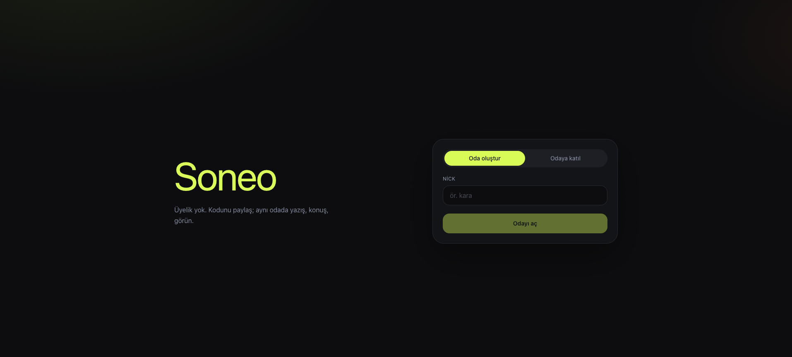
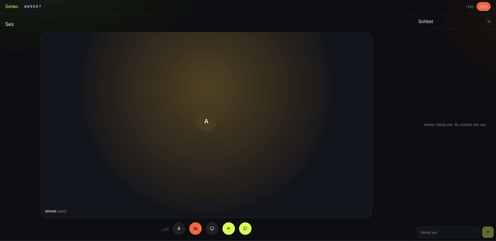

# Soneo

Pick a nick, create a room, or join with a 6-character code. No accounts.

Voice, camera, screen share, and chat run peer to peer in the browser.

- Mic, camera, and screen share
- RNNoise noise suppression
- Fullscreen screen viewing
- Collapsible chat

## Screenshots





## Stack

pnpm workspace (`apps/web`, `apps/server`). Node 20+.

| | |
| --- | --- |
| Web | Next.js 16, React 19, Tailwind CSS v4 |
| API | Hono on `@hono/node-server` |
| Realtime | WebSocket (`ws`) for chat, signaling, and media flags |
| Media | Mesh WebRTC (perfect negotiation, Google STUN, no TURN) |
| Noise | RNNoise via `@sapphi-red/web-noise-suppressor` |
| Tests | Vitest |

Rooms live in memory on a single API process. The last person to leave closes the room.

## Develop

```bash
pnpm install
pnpm dev
```

- Web: [http://localhost:3000](http://localhost:3000)
- API: [http://localhost:4000](http://localhost:4000)

```bash
pnpm test
```
